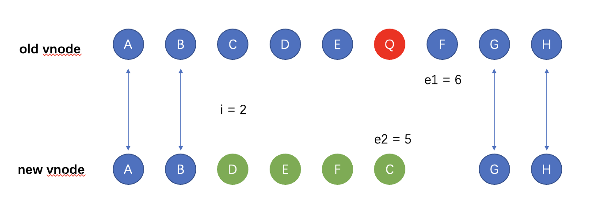
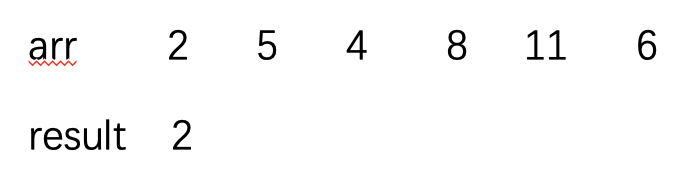
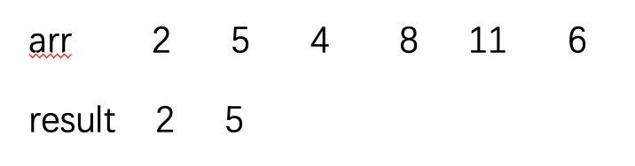
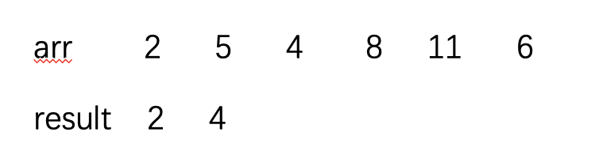
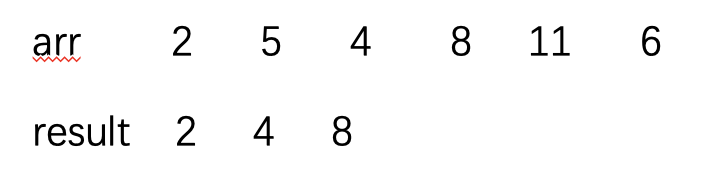
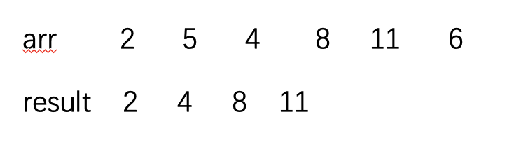
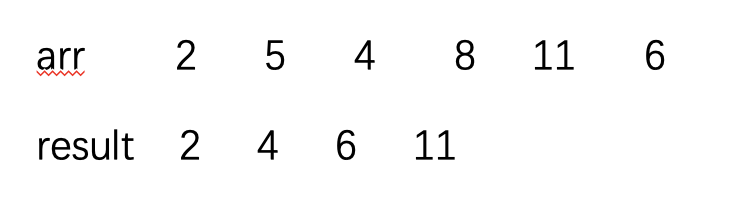

### vue3中的diff算法核心部分
此篇文章只是记录diff最核心部分的内容，即前后同级节点数组的对比。
#### 先了解一下大概思路
**注意一定要弄清楚 newIndexToOldMapIndex 和 increasingIndexSequence 中存的是什么**
* 先对只在头尾增删节点的情况特殊处理
* 对普通情况做处理，也就是diff的核心部分
  * 遍历未对比新节点，得到新节点的key和索引做的映射表 keyToNewIndexMap
  * 遍历未对比的老节点，根据keyToNewIndexMap得到未对比的新节点 在老节点数组中的位置 组成的数组 newIndexToOldMapIndex ，即**老节点的索引按新节点顺序组成的数组**，未找到老节点的项赋值为0；此步骤中会删除新节点中没有的元素。
  * 找到 newIndexToOldMapIndex 的最长递增子序列，也就是找到维持不动的元素的索引组成的数组 increasingIndexSequence，注意每项存的是**老节点的索引按新节点顺序组成的数组 的 索引**
  * 做未对比新节点长度的循环，依条件做判断
    * newIndexToOldMapIndex[i] 为0，则表示老节点中没有，是新增元素，执行对应位置插入节点操作
    * i 在 increasingIndexSequence 中不存在，则表示非最长递增子序列中的元素，执行移动元素位置操作

#### diff优化内容
vue3中对于一些特殊情况的变化，进行了优化。
* 尾部插入或者删除节点

从前往后遍历，直至新老节点数组有一个遍历完则结束。此时若老节点仍有未遍历完的，则是要删除的部分；若新节点有未遍历完的，则是新增部分，直接插入即可。
```html
<!-- 老节点 -->
<p key="a" style="background: grey">A</p>
<p key="b" style="background: yellow">B</p>

<!-- 新节点 -->
<p key="a" style="background: chocolate">A</p>
<p key="b" style="background: chocolate">B</p>
<p key="c" style="background: pink">C</p>
```
```js
let i = 0;
let e1 = 1.length - 1; // 老节点数组最后一项的索引
let e2 = c2.length - 1; // 新节点数组最后一项的索引
while( i <= e1 && i <= e2){ // 任意子节点循环完，则循环比对结束
  const n1 = c1[i];
  const n2 = c2[i];
  if(isSameVnodeType(n1, n2)){
    patch(n1, n2, el); // 递归比对子元素
  } else {
    break;
  }
  i++;
}
console.log(i, e1, e2); // 记住此时三者的值，下文有处理方法
//  2 1 2
```
> c1 和 c2 分别是老节点数组和新节点数组，下文是一样的
> 下文中所有的1和2都分别对应老节点和新节点或其属性
> isSameVnodeType：判断是否是同一个节点，是否值得比较
> patch：diff算法入口api名称，参数：node1, node2, container, anchor；分别代表对比元素、容器，若node1==null，则是插入n2元素,anchor是元素插入参照位。
* 头部插入或者删除节点

从后往前遍历，直至新老节点数组有一个遍历完则结束。此时若老节点扔有未遍历完的，则是要删除的部分；若新节点有未遍历完的，则是新增部分，直接插入即可。
```html
<!-- 老节点 -->
<p key="a" style="background: grey">A</p>
<p key="b" style="background: yellow">B</p>
<p key="c" style="background: pink">C</p>

<!-- 新节点 -->
<p key="b" style="background: chocolate">B</p>
<p key="c" style="background: pink">C</p>
```
```js
while(i <= e1 && i <= e2) {
  const n1 = c1[e1];
  const n2 = c2[e2];
  if(isSameVnodeType(n1, n2)) {
    patch(n1, n2, el)
  } else {
    break;
  }
  e1--;
  e2--;
}
console.log(i, e1, e2); 
// 0 -1 0
```
* 对上边两种特殊的情况做处理

判断是新增属性，及对应处理方法
```js
if(i > e1 && i <= e2){ // 确定是新增元素的判断条件
  const nextPos = e2 + 1;
  // 如果有下一个，则说明是往前插入
  const anchor = nextPos < c2.length ? c2[nextPos].el : null;
  while(i <= e2){ // 将 c2 中剩余的插入到 anchor 前边
    patch(null, c2[i], el, anchor) // 插入元素
    i++
  }
}
```
判断是删除属性
```js
if(i > e2){  // 确定是删除元素的判断条件
  while(i <= e1) {
    hostRemove(c1[i].el); // 直接删除元素
    i++;
  }
}
```
#### diff 的核心
若上边两种结果都未满足，则继续无特殊规则的情况。**重点呦**
老规矩，还是先上节点例子：
```html
<!-- 老节点 -->
<p key="a" style="background: pink">A</p>
<p key="b" style="background: pink">B</p>

<p key="c" style="background: pink">C</p>
<p key="d" style="background: pink">D</p>
<p key="e" style="background: pink">E</p>
<p key="q" style="background: pink">Q</p>
<p key="f" style="background: pink">F</p>

<p key="g" style="background: pink">G</p>
<p key="h" style="background: pink">H</p>

<!-- 新节点 -->
<p key="a" style="background: yellow">A</p>
<p key="b" style="background: yellow">B</p>

<p key="d" style="background: yellow">D</p>
<p key="e" style="background: yellow">E</p>
<p key="f" style="background: yellow">F</p>
<p key="c" style="background: yellow">C</p>

<p key="g" style="background: yellow">G</p>
<p key="h" style="background: yellow">H</p>
```
* 经过上边步骤的处理后，需要处理的节点就剩下 CDEQF -> DEFC ，同时 i,e1,e2 的值分别为 2,6,5。初始化 s1=s2=i 。

* 遍历新节点数组中剩下的节点，以节点的key和索引做映射表

```js
const keyToNewIndexMap = new Map();
for(let i = s2; i <= e2; i++){
  const nextChild = c2[i];
  keyToNewIndexMap.set(nextChild.key, i);
}
```
* 遍历老节点数组中剩下未对比的节点，取得未对比的新节点 在老节点数组中的索引 组成的数组   

同时会删除新节点中没有的老节点。
上边中新节点 D E F C 在老节点数组中的位置分别为 4 5 7 3，所以上边处理后得到的 newIndexToOldMapIndex = [4, 5,7, 3]。
```js
const toBePatched = e2 - s2 + 1;  // 新节点中未对比的节点的长度
const newIndexToOldMapIndex = new Array(toBePatched).fill(0); // 创建对应长度的数组，初始值为0，后续会判断是否为0作为是否新增元素的条件
for(let i = s1; i <= e1; i++){ // 遍历老节点中未对比的节点
  const prevChild = c1[i];
  let newIndex = keyToNewIndexMap.get(prevChild.key); // 老节点中当前元素的key在新节点数组中的索引
  if(newIndex == undefined) { // 老的有，新的没有，直接删除
    hostRemove(prevChild.el); 
  } else { // 新老都有的元素进行对比
    newIndexToOldMapIndex[newIndex - s2] = i + 1; //赋值为对应节点在老节点数组中的位置(从1开始，是下标加1)
    patch(prevChild, c2[newIndex], el); // 节点对比
  }
}
```
* 找出 newIndexToOldMapIndex 的最长递增子序列，即找到了不用修改移动的节点，继而便可确定需要插入或移动的最少的节点，即最优的dom操作方案。
```js
let increasingIndexSequence = getSequence(newIndexToOldMapIndex);  // [0,1,2]
// getSequence 算法看下文
```
* 遍历未对比的新元素节点数组，根据 increasingIndexSequence 调换元素节点位置。
```js
let j = increasingIndexSequence.length - 1; // 最后一项的索引，用来记录不需移动元素数组项
for(let i = toBePatched - 1; i >= 0; i--){
  const nextIndex = s2 + i; // edch 找到了 h 
  const nextChild = c2[nextIndex]; // 找到 h 的索引
  let anchor = nextIndex + 1 < c2.length ? c2[nextIndex + 1].el : null; // 找到当前元素的下一个元素，作为dom插入参照节点
  if(newIndexToOldMapIndex[i] == 0){ // 这是一个新元素，则直接插入到当前元素的下一个即可
    patch(null, nextChild, el, anchor)
  } else {
    // i在最长递增子序列中不存在，则是需要移动的节点
    if(j < 0 || i != increasingIndexSequence[j]) {
      // 根据参照节点移动需要移动的元素
      hostInsert(nextChild.el, el, anchor);
    } else {
      j--;
    }
  }
}
```

#### 最长递增子序列
* 定义

找到给定序列递增的子序列中最长的，例如 [2,5,4,8,11,6]， 需要找到[2,4,8,11]。
* 思路

就拿上边例子讲述了，先看下边几张图，逻辑就是遍历数组arr，将arr[i]按大小插入到result中。

第一个元素直接插入 result 中。

第二个元素 5 比 2 大，插入 result 中。

第三个元素 4 比 2 大，比 5 小，在后续的数据中，4 比 5 更有潜力，所以 4 将 5 替换。

第四个元素 8 比 4 大，插入 result 中。

第五个元素 11 比 8 大，插入 result 中。

第六个元素 6 比 4 大，比 8 小，将 8 替换。
>所以最后得到最长递增子序列的长度为4，但是[2,4,6,11]的顺序是有问题，所以实际算法中会增加变量p，用来拷贝arr，存储原有数据，而且result中存放的是各项的索引。具体算法看下边实现：
* 算法实现(时间复杂度只有nlog(n)哟)

```js
function getSequence(arr){
  const p = arr.slice(); // 拷贝数组arr
  const result = [0]; // 默认以下标 0 作为开头，值存储的是 arr 数组对应项的下标
  let i, j, u, v, c; // i 用作 arr 循环；  j 是 result 的最后一项;  u和v做result二分查找时前后指针
  const len = arr.length;
  for(i = 0; i < len; i++){
    const arrI = arr[i];
    if(arrI !== 0){
      // arrI 与 result 的最后一项对比
      j = result[result.length - 1]; 
      if(arr[j] < arrI){ // 
        p[i] = j; // 将当前最后一项 放到 p 数组 对应的索引上
        result.push(i);
        continue
      }
      // arrI 与 result 每项对比，找到比它大最小的进行替换
      // 对result用二分查找方法
      u = 0;
      v = result.length - 1;
      while(u < v){ // u 和 v 相等则停止
        c = ((u+v) / 2) | 0; // c:二分查找当前的下标位置
        if(arr[result[c]] < arrI) {
          u = c + 1;
        } else {
          v = c;
        }
      }
      // u==v 对result数组中存储的下标进行相应的替换
      if(arrI < arr[result[u]]) {
        if(u > 0){
          p[i] = result[u - 1]
        }
        result[u] = i; 
      }
    }
  }
  u = result.length;
  v = result[u - 1];
  while( u-- > 0){
    result[u] = v;
    v = p[v];
  }
  return result
}

```